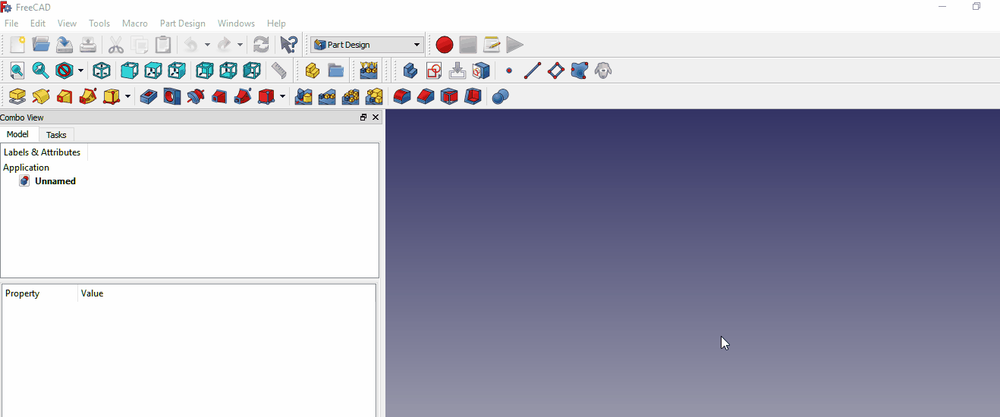

# ConstraintsToSpreadsheet
Adds named constraints from selected sketch(es) to spreadsheet and creates references.

This is a FreeCAD macro to aid setting up a spreadsheet to contain all the named constraints in one or more sketches.  To use the macro 
Select the sketches containing the named constraints you wish to add to a spreadsheet and run the macro.  If you already have 
a spreadsheet you can select it along with the sketch(es) and the selected spreadsheet will be used.  If you do not select a 
spreadsheet along with the sketch(es) you will prompted to either have the macro create a spreadsheet for you and use it or to 
cancel the operation.

The macro parses all the selected sketches looking for named constraints (unnamed constraints are ignored).  It adds all named 
constraints to the spreadsheet using columns A, B, C, and D for the constraint name, value, type, and sketch name, respectively. 
The column B value (value of the constraint) will be assigned an alias equal to the constraint name, e.g. if the name of the 
constraint is circle1Radius, then circle1Radius becomes the alias for the cell in column B, for example, B7.  The sketch is 
also modified in that the named constraint will now reference the spreadsheet using the alias created.

Be warned: Cells A1-D200 are reset each time the macro is run, so any values contained in any of those cells will be lost.  
Place any user values you don't want the macro to delete in columns E, F, G, etc.

**ALWAYS** select **ALL** sketches you want to use with the spreadsheet when running the macro because unselected sketches 
will be de-referenced.  (If you accidentally forget to select them all, this is easily remedied by running the macro again 
with all the sketches selected.)

First step is to ensure all of your constraints are named.  Any unnamed constraint will be ignored.  Any unconstrained elements will also be ignored.

