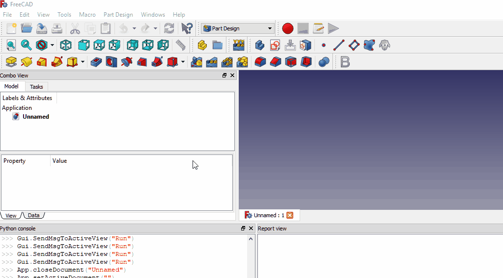

# ConstraintsToSpreadsheet
Adds named constraints from selected sketch(es) to spreadsheet and creates references.

(2018.08.20): I've decided to remove some features from this macro.  It is not normally the way things are done, just the opposite, but I think less is more in this case.  Gone: SSHelper object.  Gone: feature to take expressions from non-sketch objects.  These changes will simplify the code, reducing bugs, and also will make it easier and simpler for users.

I have left the old macro in the repository, only renaming it to ConstraintsToSpreadsheetOld.FCMacro.py for those who still wish to use it.

Here's how the macro works:

Select your spreadsheet (if one exists already) and run the macro.  If no spreadsheet is selected the macro will look for one and offer you 3 choices: 1) create a new spreadsheet; and 2) use an existing one (which will be the first one it finds); or 3) cancel the operation.

Select your sketches (or don't, either is okay).  The macro searches for unselected sketches.  If it finds any it will give 2 choices: 1) use all sketches, including unselected (except those with labels ending in underscores); 2) cancel the operation.  If you have a case where you have some sketches you wish to not be included in the processing you will need to relabel them, appending an underscore (_) to the ends of their labels in the tree view.  Similarly, individual named constraints can be hidden from the macro by appending an underscore to their names, too.

What it does: The macro will look for named constraints (except for constraint names ending in underscores, e.g. radius_ or height_, etc.) in all sketches (except sketches with labels ending in an underscore, e.g. Sketch005_, Sketch_, etc.) When it finds such a constraint it uses the name of the constraint to create an alias in a spreadsheet, and then links the constraint to that cell in the spreadsheet, which will now contain the value of the constraint (e.g. 5, 10, 25 degrees, etc.).  The macro DOES NOT move any formulas used to obtain the value, it uses the value and puts that in the spreadsheet.  For example, if you have a constraint named piTimes10 with a formula = "pi * 10" and a value of 31.4159 the macro creates a spreadsheet alias named "piTimes10" and sets the value of that spreadsheet cell to 31.4159 (not to pi*10).  Another example: suppose you have a constraint named "heightPlusWidth" with a formula = "Sketch.Constraints.height + Sketch.Constraints.width" and a value of 10 (assuming height=2 and width=8, for example).  The macro will create an alias named "heightPlusWidth" and place a value of 10 in the cell.  Thus, some parametricity is lost, depending on how you have the constraints setup.  If you don't want the constraint "heightPlusWidth" to be used, simply rename it to "heightPlusWidth_".  Alternatively, you can setup a cell in column E, F, G, H, I, J, etc. to give you this intended functionality (adding height + width).

Columns A through D are used.  If you plan to run the macro more than once, be advised any and all values in columns A through D get clobbered each time the macro is run.  DO NOT put your own cell values in columns A through D if you plan to run the macro again to update and add more named constraints to it.  Add your own cells to columns E, F, G, H, etc.  The macro will not modify those columns, only columns A through D get modified by the macro.

